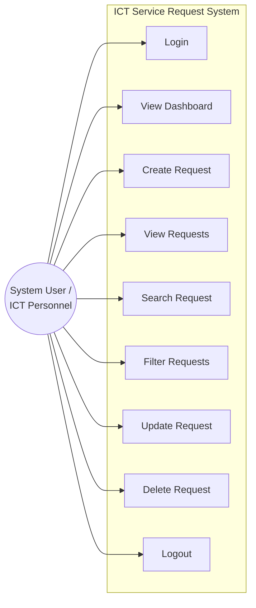
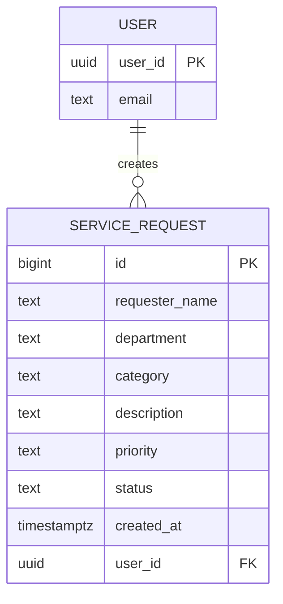
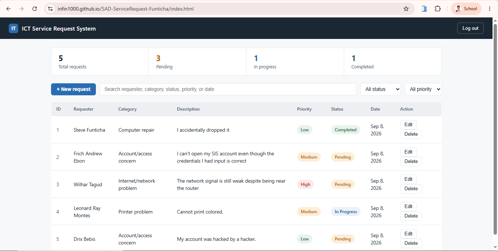

# ICT Service Request Management System

A web-based prototype that lets ICT office staff record, monitor, search, filter, and update technical support requests, built with HTML/CSS/JavaScript and a Supabase backend, deployed on GitHub Pages.

---

## Problem Statement

The university's ICT office currently receives technical support concerns through verbal reports, text messages, and social media, with no central record of what was requested or its status. Because requests arrive through different, disconnected channels, some are forgotten, duplicated, or left untracked, delaying resolution and making workload difficult to monitor. The ICT Service Request Management System addresses this by giving authorized ICT personnel a single web-based platform to record, monitor, search, filter, and update technical support requests from submission through completion, replacing informal, scattered reporting with a structured, auditable process.

---

## Use Case Diagram

| Use Case | Description |
|---|---|
| Login | Authenticate with email/password via Supabase Auth |
| View Dashboard | See total, pending, in-progress, and completed counts |
| Create Request | Submit a new service request |
| View Requests | See all requests in a table |
| Search Request | Search by requester name or description |
| Filter Requests | Filter by status and/or priority |
| Update Request | Edit an existing request's details or status |
| Delete Request | Remove a request after confirmation |
| Logout | End the session |

---

## Entity-Relationship Diagram (ERD)

A single `USER` (managed by Supabase Auth) can create many `SERVICE_REQUEST` records; each request belongs to exactly one user.

| Table | Column | Type | Constraint |
|---|---|---|---|
| USER | user_id | uuid | Primary Key (from `auth.users`) |
| USER | email | text | — |
| SERVICE_REQUEST | id | bigint | Primary Key |
| SERVICE_REQUEST | requester_name | text | NOT NULL |
| SERVICE_REQUEST | department | text | NOT NULL |
| SERVICE_REQUEST | category | text | NOT NULL |
| SERVICE_REQUEST | description | text | NOT NULL |
| SERVICE_REQUEST | priority | text | NOT NULL |
| SERVICE_REQUEST | status | text | Default: `Pending` |
| SERVICE_REQUEST | created_at | timestamptz | Default: `now()` |
| SERVICE_REQUEST | user_id | uuid | Foreign Key → `auth.users(id)` |

---

## Requirements Traceability Matrix

| Req. ID | Requirement | System Feature | Test |
|---|---|---|---|
| FR-01 | User can log in | Login page (`index.html`, `js/supabase.js`) | TC-01 |
| FR-02 | User can create a request | Request form (`dashboard.html`, `js/app.js` insert) | TC-02 |
| FR-03 | User can view requests | Request table (`dashboard.html`, `js/app.js` fetch) | TC-03 |
| FR-04 | User can update a request | Edit form (`dashboard.html`, `js/app.js` update) | TC-04 |
| FR-05 | User can delete a request | Delete button (`dashboard.html`, `js/app.js` delete) | TC-05 |
| FR-06 | User can search requests | Search input (`dashboard.html`, `js/app.js` search) | TC-06 |
| FR-07 | User can filter requests | Status/priority filters (`dashboard.html`, `js/app.js` filter) | TC-07 |
| FR-08 | System displays summaries | Dashboard counts (`dashboard.html`, `js/app.js` counts) | TC-08 |

---

## Screenshots

**Login page**

**Dashboard**

<!--  -->
<!--  -->
<!--  -->
<!--  -->

---

## Testing Results

<!-- Fill in PASS/FAIL for each test case, e.g.: -->

| Test ID | Test Scenario | Expected Result | Result |
|---|---|---|---|
| TC-01 | Login using valid account | Dashboard appears | Pass |
| TC-02 | Submit valid request | Request saved | Pass |
| TC-03 | Display requests | Existing records appear | Pass |
| TC-04 | Modify request | Changes saved | Pass |
| TC-05 | Delete request | Confirmation appears and record is removed | Pass |
| TC-06 | Search requester | Matching records displayed | Pass |
| TC-07 | Filter Pending requests | Only Pending records displayed | Pass |
| TC-08 | Open deployed URL | Application loads online | Pass |

---

## Tech Stack

- **Front end:** HTML, CSS, JavaScript — hosted on GitHub Pages
- **Backend:** Supabase (PostgreSQL + Authentication)
- **Security:** Row Level Security (RLS) policies scoped to `auth.uid()`