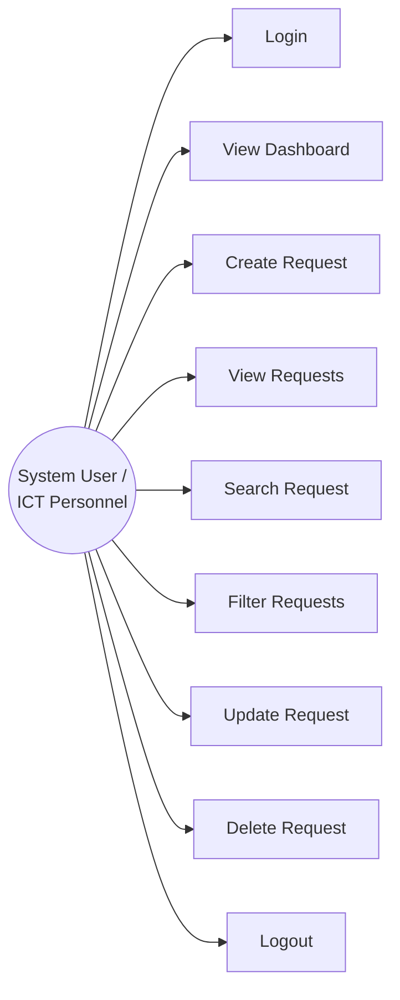
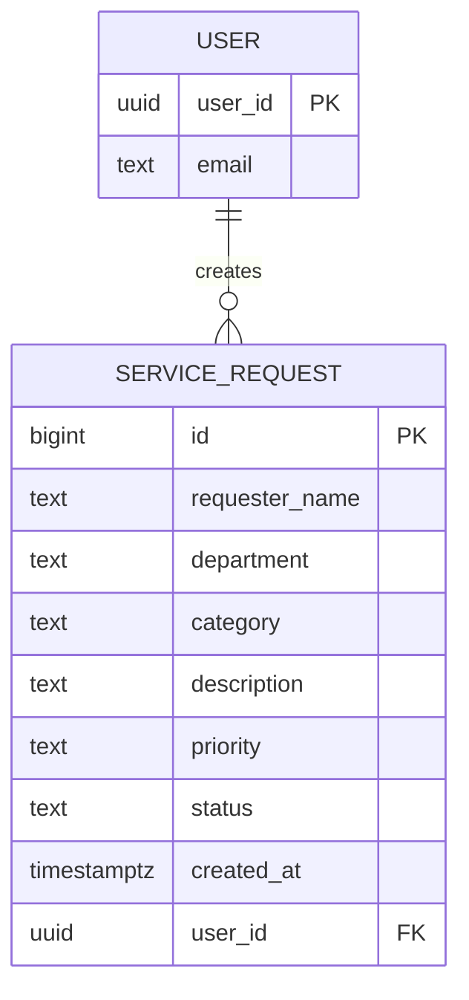

# System Analysis

## 1. Problem Statement

The university's ICT office currently receives technical support concerns through verbal reports, text messages, and social media, with no central record of what was requested or its status. Because requests arrive through different, disconnected channels, some are forgotten, duplicated, or left untracked, delaying resolution and making workload difficult to monitor. The ICT Service Request Management System addresses this by giving authorized ICT personnel a single web-based platform to record, monitor, search, filter, and update technical support requests from submission through completion, replacing informal, scattered reporting with a structured, auditable process.

*(97 words)*

## 2. Actors

**Primary actor: System User / ICT Personnel**

An authenticated staff member of the ICT office who logs into the system to record new service requests, monitor their status, and update them as work progresses. The system currently treats all authenticated users as a single actor role; it does not distinguish between, for example, requesters and technicians.


## 3. Use Case Diagram

```
                    ┌───────────────────────────────┐
                    │   ICT Service Request System   │
                    │                                 │
   ┌──────┐         │   ○ Login                       │
   │      │────────►│   ○ View Dashboard               │
   │ User │────────►│   ○ Create Request               │
   │(ICT  │────────►│   ○ View Requests                │
   │Staff)│────────►│   ○ Search Request               │
   │      │────────►│   ○ Filter Requests              │
   │      │────────►│   ○ Update Request               │
   │      │────────►│   ○ Delete Request               │
   │      │────────►│   ○ Logout                        │
   └──────┘         │                                 │
                    └───────────────────────────────┘
```

Mermaid version (renders on GitHub):



### Use case summaries

| Use Case | Description | Pre-condition | Post-condition |
|---|---|---|---|
| Login | User authenticates with email and password via Supabase Auth. | User has a valid account. | User session starts; dashboard is shown. |
| View Dashboard | User sees total, pending, in-progress, and completed request counts. | User is logged in. | Counts reflect current data. |
| Create Request | User submits a new service request. | User is logged in. | Request is stored with status `Pending`. |
| View Requests | User sees all requests in a table. | User is logged in. | Table lists current records. |
| Search Request | User searches by requester name or description. | User is logged in. | Table shows only matching records. |
| Filter Requests | User filters by status and/or priority. | User is logged in. | Table shows only records meeting the criteria. |
| Update Request | User edits an existing request's details or status. | User is logged in; request exists. | Changes are saved. |
| Delete Request | User removes a request after confirming. | User is logged in; request exists. | Record is permanently removed. |
| Logout | User ends the session. | User is logged in. | Session ends; user is redirected to login. |

## 4. Entity-Relationship Diagram (ERD)

A single ICT staff account (`USER`, managed by Supabase Auth) can create many service requests; each service request belongs to exactly one user.

```
USER                              SERVICE_REQUEST
----------------                  ----------------------
user_id (PK)      ────1───────M──▶ user_id (FK)
email                              id (PK)
                                   requester_name
                                   department
                                   category
                                   description
                                   priority
                                   status
                                   created_at
```



## 5. Business Rules

| Rule | Requirement | Where enforced |
|---|---|---|
| BR-01 | Requester name cannot be empty. | `js/app.js` form validation |
| BR-02 | Department must be provided. | `js/app.js` form validation |
| BR-03 | Category must be selected. | `index.html` dropdown + `js/app.js` validation |
| BR-04 | Description must contain sufficient information. | `js/app.js` (minimum length check) |
| BR-05 | Priority must be Low, Medium, or High. | `index.html` dropdown |
| BR-06 | New requests automatically receive `Pending` status. | `js/app.js` insert logic |
| BR-07 | Users must log in before managing requests. | `js/app.js` / `js/auth.js` session check, redirect to `login.html` |
| BR-08 | A confirmation must appear before deleting a record. | `js/app.js` `confirm()` prompt |
| BR-09 | Date requested is automatically recorded. | Supabase `created_at` default (`NOW()`) |
| BR-10 | Unauthorized database modification is prevented. | Supabase Row Level Security policies scoped to `auth.uid()` |

## 6. System Architecture

```
        INTERNET
           │
      GitHub Pages
           │
   ┌───────┴────────┐
   │                │
 HTML/CSS       JavaScript
   │                │
   └───────┬────────┘
           │
     Supabase JS Client
           │
        HTTPS/API
           │
        SUPABASE
   ┌───────┴────────┐
   │                │
Authentication   PostgreSQL
                    │
              service_requests
```

GitHub Pages hosts the static front end (HTML, CSS, JavaScript). The browser calls the Supabase JavaScript client directly over HTTPS to authenticate users and perform CRUD operations against the `service_requests` table, with Row Level Security enforcing that a user can only modify records they created.
